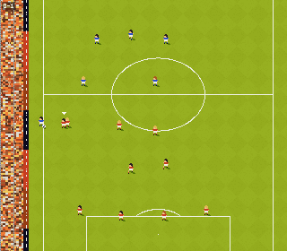

# Sensi

A browser remake of the classic top-down arcade football feel of *Sensible
Soccer*, written from scratch in **TypeScript + Canvas 2D** with **Vite**. No
game engine, no image assets — every sprite, the pitch, the goals and the crowd
are generated procedurally at boot onto offscreen canvases.



## Play

```bash
npm install
npm run dev      # http://localhost:5173
```

```bash
npm run build    # type-check + production build to dist/
npm run preview  # serve the production build
```

The game runs at a base resolution of 320×280 game pixels, integer-scaled to
your window with nearest-neighbour filtering for crisp pixels.

## Controls

| Key | Action |
|-----|--------|
| **WASD** | move — Player 1 (red) |
| **Space** | tap = pass · hold = shot power · release = strike |
| after a kick | hold a direction for **aftertouch** (curl / loft) |
| Space (no ball) | slide tackle |
| **Arrows + Enter** | Player 2 (blue) — when two-player is on |
| **2** | toggle two-player |
| **P** / **Esc** | pause |
| **R** | reset to kickoff |

The action button auto-controls the player on your team nearest the ball; a
chevron marks who you're driving.

### Touch (mobile)

On phones and tablets an on-screen overlay appears automatically: a **floating
joystick** (left thumb — touch anywhere on the lower-left to summon it) and a
single **action button** (right thumb) carrying the same tap / hold / release
semantics as Space, including post-kick aftertouch via the joystick. Pause and
reset buttons sit in the top corners. Append `?touch=1` to the URL to force the
overlay on a desktop browser. Two-player is keyboard-only.

## What's in it

- Fixed-timestep 60 Hz simulation with interpolated rendering; deterministic,
  all randomness through one seeded PRNG.
- Ball physics: rolling friction, gravity, bounce, spin, and **aftertouch**.
- Sticky-but-loose dribbling, passes, power shots, slide tackles that knock
  players down, and tackle-by-contact.
- Two AI teams in a 4-3-3 with formations, pressing/positioning behaviour and
  goalkeepers (distinct kit).
- Match rules: goals + scoring, kickoffs, and real restarts — throw-ins, goal
  kicks and corners with the taker delivering the ball.
- Procedural art: mottled grass, pitch markings, 3D-read goals whose nets catch
  the ball, a rowed crowd and ad boards, and an 8-direction player sprite atlas
  (idle / run / kick / slide / fallen) recoloured per team kit.

## Project structure

```
src/
  main.ts          boot, canvas, integer-scale resize, the game loop wiring
  loop.ts          fixed-timestep accumulator
  input.ts         keyboard (two channels), tap/hold edges
  world.ts         pitch dimensions, camera, world<->screen
  ball.ts          ball state + physics, aftertouch, net containment
  player.ts        player state machine, dribble/kick, AI movement helpers
  team.ts          formations + team construction
  ai.ts            chase / position / carrier / goalkeeper behaviours
  match.ts         rules: goals, scoring, restarts, kickoff
  state.ts         shared entity/state types
  render.ts        draw order, sprites, shadows, HUD, overlays
  sprites/
    palette.ts     colour constants
    pitch_gen.ts   baked pitch: grass, markings, goals, crowd, boards
    player_gen.ts  procedural player sprite atlas (+ palette swap)
```

## Legal

This is an original homage, not a copy. It contains **no** original *Sensible
Soccer* assets — all graphics are generated procedurally in our own style,
derived only from era-correct *metrics* (proportions, palette feel). *Sensible
Soccer* is a trademark of its respective owners; this project is unaffiliated.

The code in this repository is released under the [MIT License](LICENSE).
