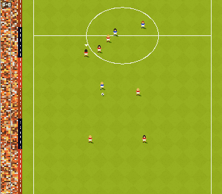

# Sensi

A browser remake of the classic top-down arcade football feel of *Sensible
Soccer*, written from scratch in **TypeScript + Canvas 2D** with **Vite**. No
game engine, no image assets — every sprite, the pitch, the goals and the crowd
are generated procedurally at boot onto offscreen canvases.



## Play

```bash
npm install
npm run dev      # http://localhost:5173
```

```bash
npm run build    # type-check + production build to dist/
npm run preview  # serve the production build
```

The game runs at a base resolution of 320×256 game pixels, integer-scaled to
your window with nearest-neighbour filtering for crisp pixels.

## Controls

| Key | Action |
|-----|--------|
| **WASD** | move — Player 1 (red) |
| **Space** | tap = pass · hold = shot power · release = strike |
| after a kick | hold a direction for **aftertouch** (curl / loft) |
| Space (airborne ball near) | **diving header** — aims along the held direction, else at goal |
| Space (no ball) | slide tackle |
| **Arrows + Enter** | Player 2 (blue) — when two-player is on |
| **2** | toggle two-player |
| **P** / **Esc** | pause |
| **R** | reset to kickoff |

The action button auto-controls the player on your team nearest the ball; a
chevron marks who you're driving.

### Touch (phones / tablets)

On coarse-pointer devices (or with `?touch=1` in the URL) an on-screen overlay
appears and the game fills the **whole screen**: the view is resized to the
display's aspect (landscape widens it — the full pitch width plus extended
stands; portrait lengthens it), so there are no black bars:

- **left thumb** — floating joystick (appears where you touch): move, aim set
  pieces, aftertouch.
- **right thumb** — the whole lower-right zone is the **KICK** button: tap =
  pass, hold = shot power, hold with no ball = slide.
- **top-right** — pause and back buttons. During a match, back pauses first;
  pressing it again while paused quits (no accidental exits).

Touch drives Player 1 alongside the keyboard; two-player stays keyboard-only.

## What's in it

- Fixed-timestep 60 Hz simulation with interpolated rendering; deterministic,
  all randomness through one seeded PRNG.
- Ball physics: rolling friction, gravity, bounce, spin, and **aftertouch**.
- Sticky-but-loose dribbling, passes, power shots, slide tackles that knock
  players down, and tackle-by-contact.
- Two AI teams in a 4-3-3 with formations, pressing/positioning behaviour and
  goalkeepers (distinct kit). Every nation carries a 1-5 star skill rating
  (shown in the team browser) that scales its players' pace, how cleanly the
  AI passes and shoots, and simulated competition results.
- Match rules: goals + scoring, kickoffs, and real restarts — throw-ins, goal
  kicks and corners with the taker delivering the ball. The offside rule is
  enforced (toggle it in Options, SWOS-style): the first flagged player to
  touch a pass concedes a free kick where he stood.
- Drawn knockout ties (Cup / World Cup KO rounds) go to a real penalty
  shootout — aim across the goal mouth, hold for power — instead of a
  simulated result.
- Goals get a half-speed **action replay** of the move (any button skips);
  press the button as an airborne ball arrives for a **diving header**.
- Procedural art: mottled grass, pitch markings, 3D-read goals whose nets catch
  the ball, a rowed crowd and ad boards, and an 8-direction player sprite atlas
  (idle / run / kick / slide / fallen) recoloured per team kit.

## Sound

Like the graphics, the audio uses **no asset files** — every sound effect is
synthesized at runtime with the **Web Audio API** ([src/audio.ts](src/audio.ts)).

- **One `AudioContext`, created lazily.** Browsers block audio until a user
  gesture, so the context is built on the first `keydown` / `pointerdown` /
  `touchstart` (this also unlocks iOS). A small bottom-left badge shows whether
  sound still needs a gesture or is muted (toggle with **M**); volume and mute
  persist to `localStorage`.
- **Everything runs through a master gain → compressor → output.** The
  compressor is a gentle limiter so layered hits don't clip. A shared 1-second
  white-noise buffer feeds all the noise-based effects.
- **Effects are built from a few primitives** shaped by gain envelopes:
  - `thud` — a pitch-dropping sine "pop" plus a noise click → passes, shots,
    tackles.
  - `tick` — a short band/high-passed noise burst → ball bounces, contact.
  - `scrape` — noise through a downward-sweeping lowpass → slide-tackle grass.
  - `whistle` — a ~2.6 kHz square tone with a 28 Hz trill LFO (the pea rattle),
    one or more blasts → kickoff / out / goal whistles.
  - `roar` — a swelling lowpassed noise burst → goal celebration.
- **A looped crowd bed** (heavily lowpassed white noise) murmurs underneath; its
  level is driven by a smoothed `crowdIntensity` that rises near the goals and
  spikes on a goal.

The simulation never plays sound directly. It pushes events via `emitSfx()`
(a cheap array push, deduped per-sound by a minimum interval), and the render
loop calls `flushSfx()` once per frame to realize them. Audio is a pure
side-effect sink — it never reads back into game state or the seeded PRNG, so
the fixed-step sim stays fully deterministic whether or not sound is running.

## Project structure

```
src/
  main.ts          boot, canvas, integer-scale resize, the game loop wiring
  loop.ts          fixed-timestep accumulator
  input.ts         keyboard (two channels), tap/hold edges
  world.ts         pitch dimensions, camera, world<->screen
  ball.ts          ball state + physics, aftertouch, net containment
  player.ts        player state machine, dribble/kick, AI movement helpers
  team.ts          formations + team construction
  ai.ts            chase / position / carrier / goalkeeper behaviours
  match.ts         rules: goals, scoring, restarts, kickoff
  audio.ts         procedural Web Audio SFX + crowd bed, event queue
  state.ts         shared entity/state types
  render.ts        draw order, sprites, shadows, HUD, overlays
  sprites/
    palette.ts     colour constants
    pitch_gen.ts   baked pitch: grass, markings, goals, crowd, boards
    player_gen.ts  procedural player sprite atlas (+ palette swap)
```

## Legal

This is an original homage, not a copy. It contains **no** original *Sensible
Soccer* assets — all graphics are generated procedurally in our own style,
derived only from era-correct *metrics* (proportions, palette feel). *Sensible
Soccer* is a trademark of its respective owners; this project is unaffiliated.

The code in this repository is released under the [MIT License](LICENSE).
